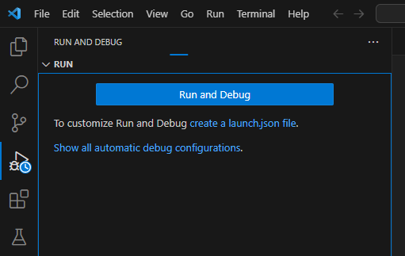
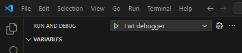

# VS Code Ewt Extension

This extensions helps developing Ewt application in VS Code.

Main features are:
- Ewt script debugger
- Ewt script grammar tokenizer
- Ewt script theme

## Debugger

The debugger connects to Ewt using a socket. It is based on Debug Adapter Protocol (DAP).

In order to debug an Ewt application through VS Code, please do following:

1.  Open Ewt application folder in VS Code
2.  Edit `config.xml` file in order to enable `dev` mode and open a port for debugger socket.
    ```xml
    <?xml version="1.0" encoding="UTF-8"?>
    <config>
      <admin>
        <runMode>dev</runMode>
        <debuggerPort>8000</debuggerPort>
        <!-- option : adresse IP de bind -->
        <debuggerAddress>0.0.0.0</debuggerAddress>
        ...
      </admin>
      ...
    ```
3.  Save modifications and start application server. Just reset Ewt application if application
    server is already running.
4.  In VS Code, open pannel "Run and Debug" (Ctrl + Shift + D). The very first time, you'll
    have to create a launch configuration. Click on `create a launch json file`  
    
5.  Adapt `launch.json` file as following
    ```json
    {
        "version": "0.2.0",
        "configurations": [
            {
                "type": "mock",
                "request": "launch",
                "name": "Ewt debugger",
                "program": "Mon application",
                "stopOnEntry": true,
                "debugServer": 8000,
                "scriptsRoot": "${workspaceFolder}\\scripts"
            }
        ]
    }
    ```
    You must fill the `scriptsRoot` property with absolute path of scripts directory.
6.  Save modification. Now you should see a dropdown with label "Ewt debugger" in the panel  
      
    Click on the green arrow and start debugger.


